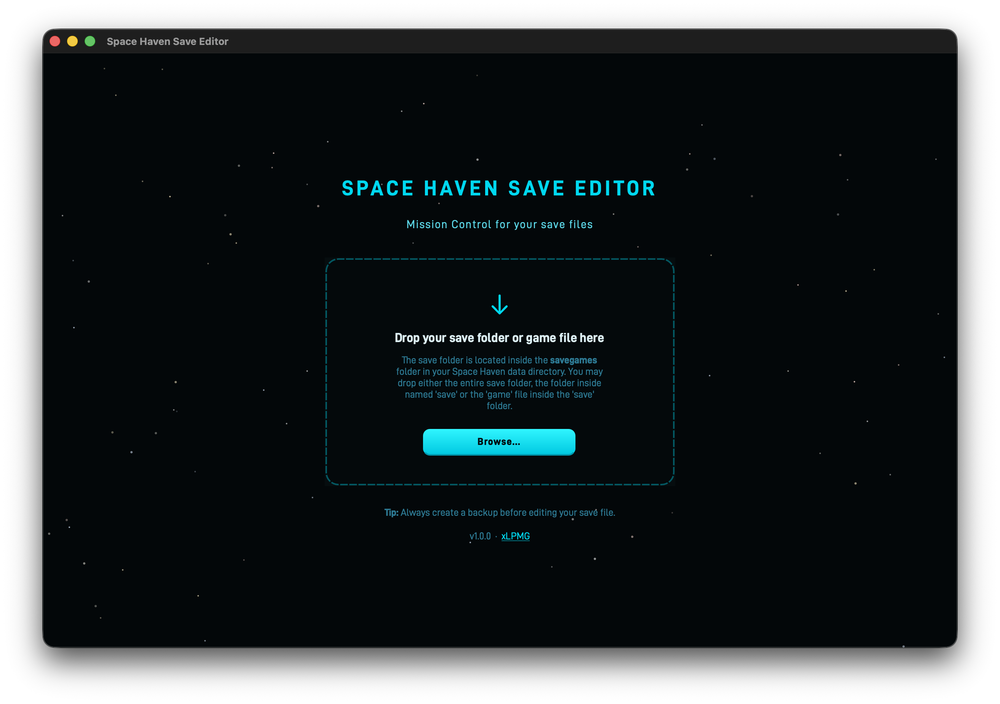
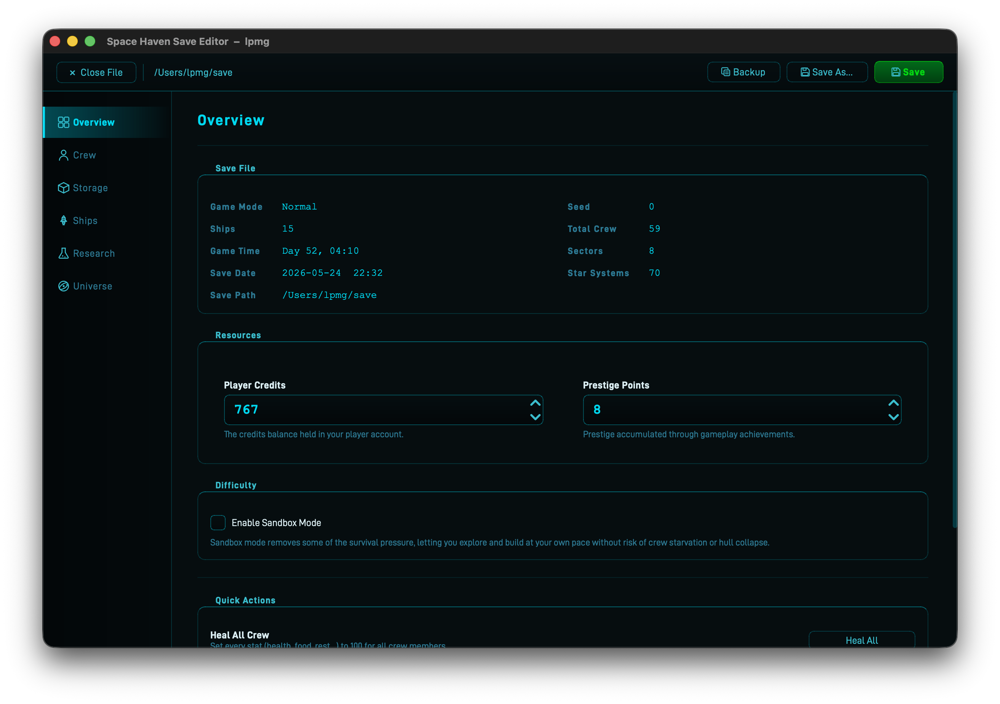
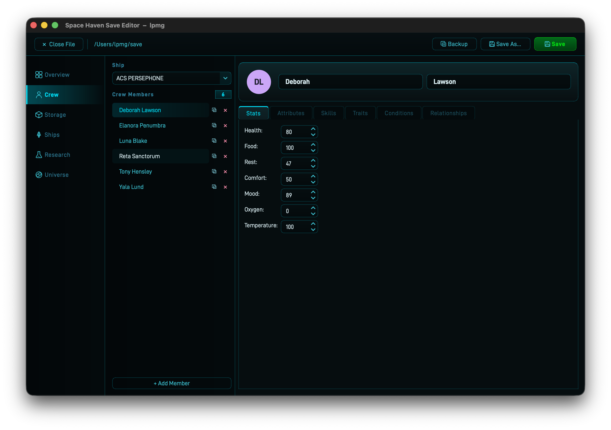
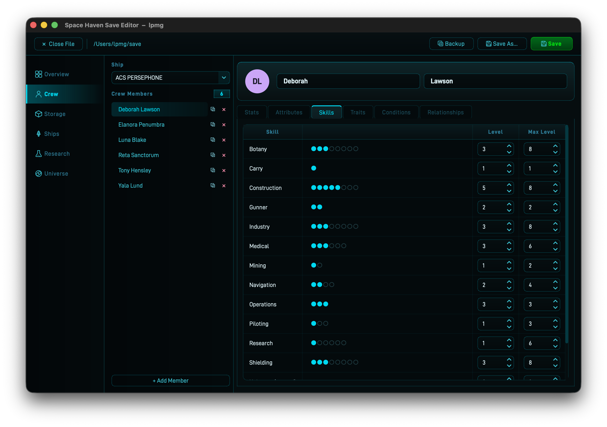
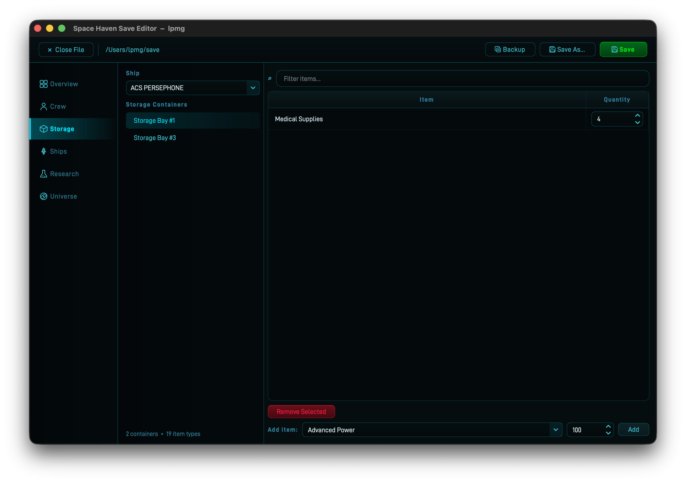
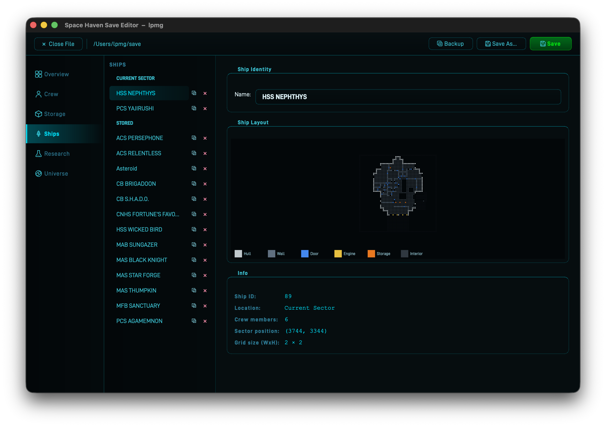
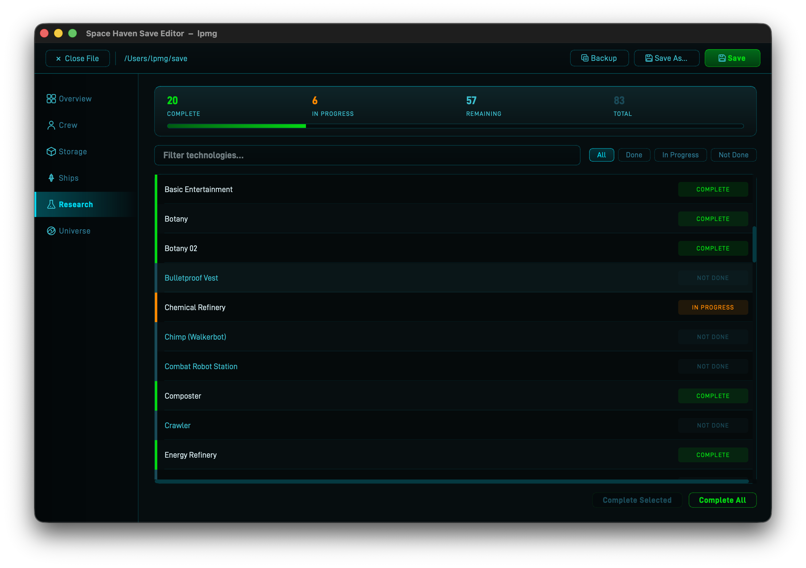
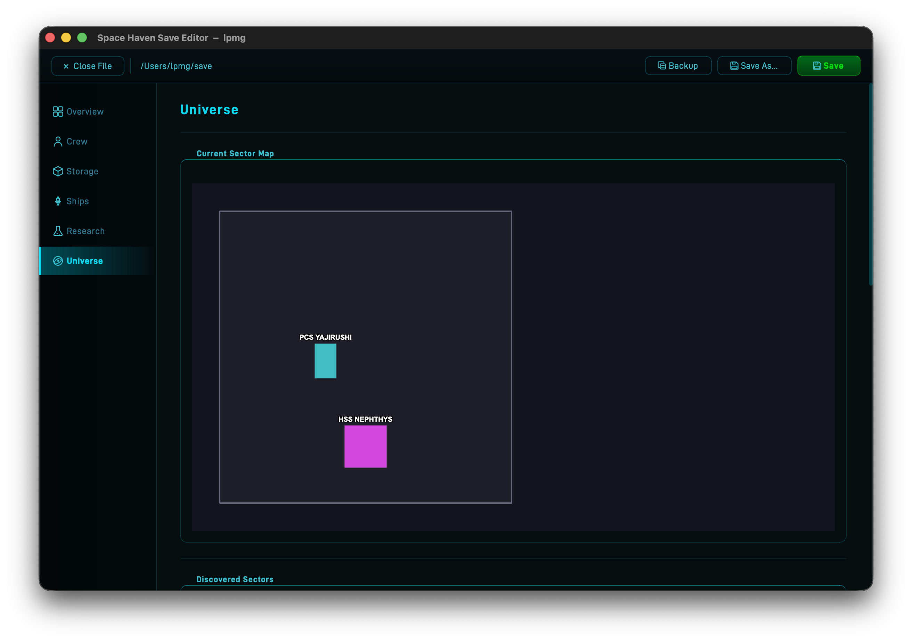
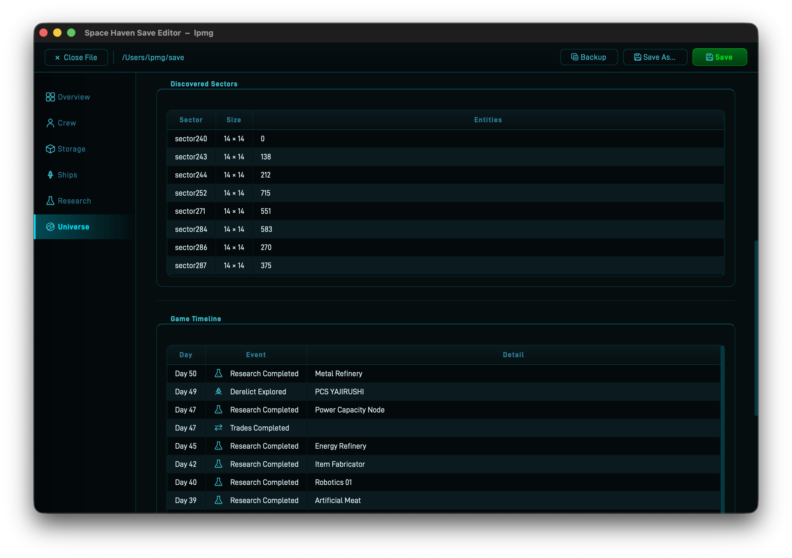

# Space Haven Save Editor

A desktop save file editor for [Space Haven](https://bugbyte.fi/spacehaven/), the space colony sim by Bugbyte. If you want to give your crew a fighting chance, unlock research, or recover a run that went sideways, this tool lets you do that without touching raw XML.

## What you can edit

- **Globals** – change game-wide values such as credits
- **Crew** – rename characters, adjust stats (health, food, rest, mood, and more), skills, traits, conditions, and inter-crew relationships
- **Ships** – rename ships, adjust grid dimensions, and add or remove ships from your fleet
- **Storage** – browse each ship's storage containers and change item quantities
- **Research** – view the state of every technology and mark any of them as complete
- **Universe** – view the sector map, discovered sectors, and the game timeline

## Download

Pre-built binaries are available on the [Releases](../../releases) page. Download the zip for your platform and extract it.

| Platform | File | Requirement |
|---|---|---|
| macOS | `SpaceHaven-Save-Editor-macos.zip` | Apple Silicon (M1 or later) |
| Windows | `SpaceHaven-Save-Editor-windows.zip` | Windows 10/11, x64 |

The macOS build runs on Apple Silicon only. Intel Mac users need to run from source (see below).

**macOS Gatekeeper warning**

Because the app is not notarized, macOS will block it on first launch with a message saying the developer cannot be verified. To allow it:

1. Try to open the app — it will be blocked.
2. Open **System Settings → Privacy & Security** and scroll down.
3. You should see a message about the blocked app. Click **Open Anyway**.
4. Confirm in the dialog that follows.

You only need to do this once.

## Tabs

### Welcome Screen



The first thing you see when the app launches. Against an animated starfield background, a drop zone invites you to load a save. You can either:

- **Drag and drop** a save folder, the `save` subfolder inside it, or the `game` file directly onto the drop zone.
- Click **Browse…** and choose **Open Save Folder…** or **Open game File…** from the menu.

Once a file is loaded the welcome screen is replaced by the editor tabs.

### Overview



An overview page with several sections:

- **Save File** – read-only summary of the loaded save (game mode, world seed, ship and crew counts, game time, sector and star-system counts, save date, and file path)
- **Resources** – editable spinboxes for **Player Credits** and **Prestige Points**
- **Difficulty** – toggle **Sandbox Mode** on or off
- **Quick Actions** – one-click operations that apply across the entire save:
  - *Heal All Crew* – sets every stat (health, food, rest, …) to 100 for all crew members
  - *Max All Skills* – raises all crew skills to level 20
  - *Clear All Conditions* – removes every active condition (injuries, mood effects, etc.) from all crew
  - *Fill All Storage* – sets every item in every storage container to a chosen quantity (default 9 999)

### Crew





Select a ship from the dropdown to see its crew roster. Click a crew member to open their detail panel, which has six sub-tabs:

| Sub-tab | What you can change |
|---|---|
| **Stats** | Health, food, rest, mood, and other survival stats |
| **Attributes** | Attribute point allocation |
| **Skills** | Individual skill levels |
| **Traits** | Add or remove personality traits |
| **Conditions** | View and clear active conditions such as injuries or mood effects |
| **Relationships** | Inter-crew relationship values |

You can also rename a character (first and last name separately), duplicate a crew member with the clone button, remove them with the remove button, or add a brand-new crew member to any ship.

### Storage



Choose a ship from the dropdown, then pick a storage container from the list on the left. The right panel shows all items currently in that container along with their quantities. You can change any item's quantity directly in the table. A filter box at the top of the item list lets you search by item name.

### Ships



Lists every ship in the save, grouped by fleet membership. Selecting a ship shows:

- **Name** – editable inline
- **Ship Layout** – a visual grid of the ship's tile map
- **Info** – read-only fields for ship ID, current location, crew count, sector position, and grid dimensions (W × H)

The clone and remove buttons in the list let you duplicate or delete a ship entirely.

### Research



Displays all technologies with a status badge for each entry (**COMPLETE**, **IN PROGRESS**, or **NOT DONE**). A banner at the top shows the total counts and an overall progress bar.

Use the filter buttons and the search box to narrow the list, then:
- Select one or more entries and click **Complete Selected** to mark them done.
- Click **Complete All** to unlock every technology at once.

### Universe





A read-only view of the broader game state:

- **Sector Map** – an interactive 2-D map of the current sector showing ship positions; ships can be dragged to new coordinates
- **Discovered Sectors** – a table listing every sector the player has visited, with its size and entity count
- **Game Timeline** – a chronological log of notable events (crew arrivals and deaths, derelicts explored, missions and quests completed, trade milestones, research breakthroughs, and galaxy transitions)

## Setup (from source)

**Prerequisites:** Python 3.9+

```bash
git clone https://github.com/xLPMG/SpaceHaven-Save-Editor.git
cd SpaceHaven-Save-Editor
python -m venv .venv
source .venv/bin/activate       # Windows: .venv\Scripts\activate
pip install -r requirements.txt
```

## Running

```bash
python main.py
```

## Usage

1. Launch the editor and use **File → Open** (or drag your save file onto the window) to load a save.
2. Space Haven save files are named `game` and live inside numbered slot folders in the game's save directory. The exact path on your system is shown in the game's main menu under save management.
3. Use the tabs on the left to navigate between sections and make your changes.
4. Save with **File → Save** or **Ctrl+S**. A timestamped backup of the original file is created automatically before anything is written to disk.

Keep a manual backup before making sweeping changes — the backup the editor creates covers you for a single session, not for repeated overwrites.

## Running tests

```bash
pytest
```

